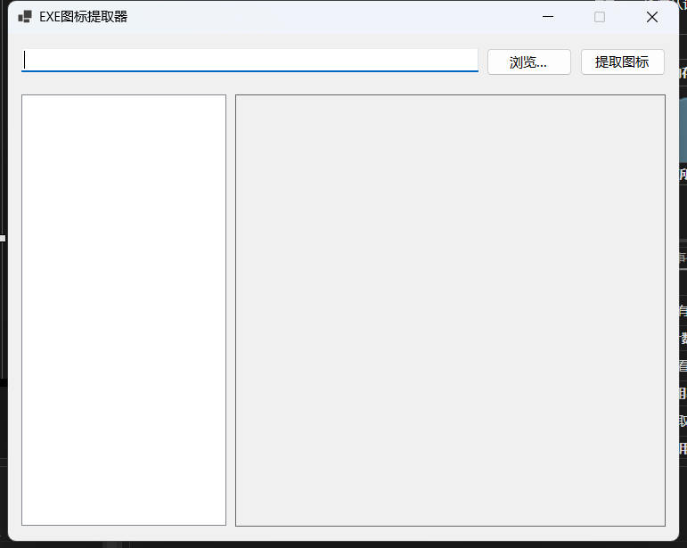

# ExeIconExtractor

ExeIconExtractor 是一个用于从可执行文件(.exe)中提取图标的Windows应用程序。

## 功能特性
- 从Windows可执行文件中提取图标资源
- 支持保存提取的图标为多种格式
- 用户友好的图形界面

## 软件截图

## 技术栈
- C#
- .NET 8.0
- Windows Forms

## 构建和运行
1. 使用Visual Studio 2022或更高版本打开解决方案文件 `ExeIconExtractor.sln`
2. 还原NuGet包（如有必要）
3. 构建解决方案（F6）
4. 运行项目（F5）

## 使用说明
1. 启动应用程序
2. 通过浏览按钮选择目标可执行文件
3. 点击"提取图标"按钮
4. 选择保存位置和格式
5. 保存提取的图标

## 开发环境
- Windows操作系统
- .NET 8.0 SDK
- Visual Studio 2022